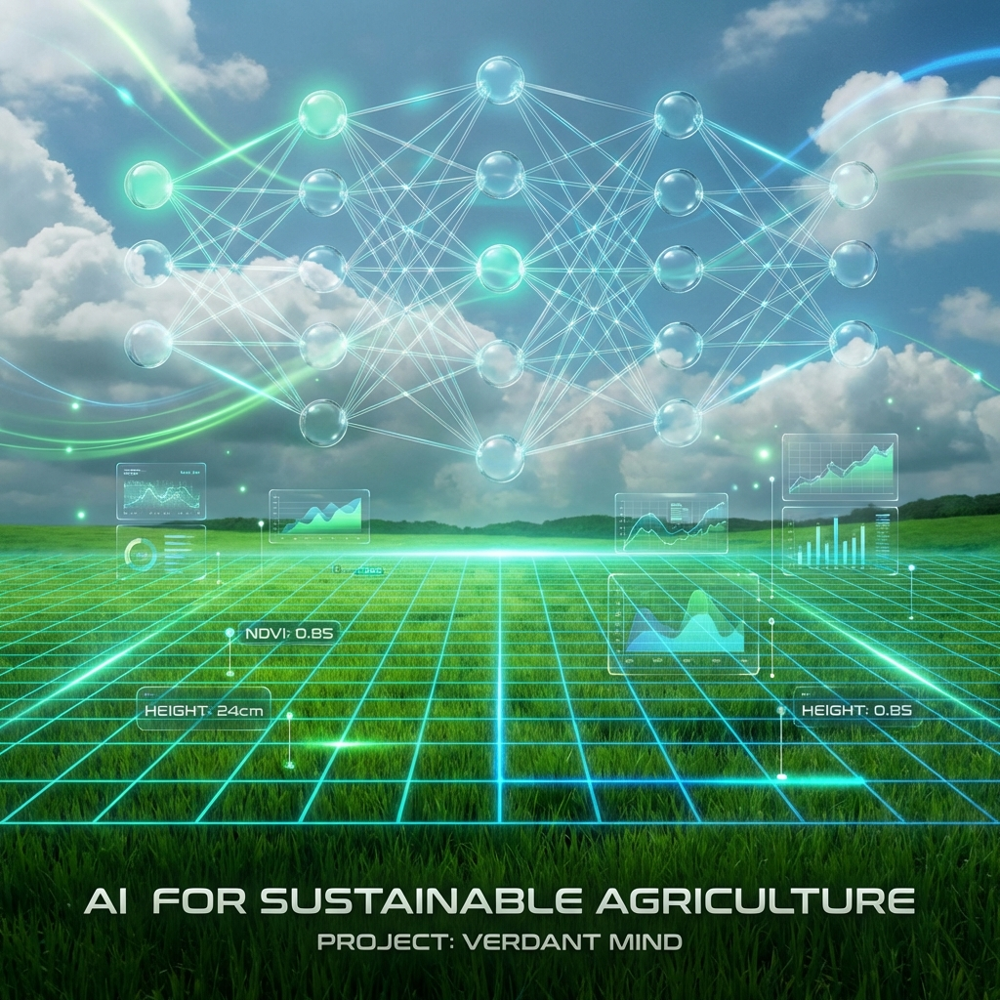

# 🌿 Verdant Mind: Advanced Pasture Biomass Prediction



## 🚀 Overview
This repository contains a state-of-the-art Computer Vision framework designed for the **CSIRO Image2Biomass Prediction Challenge**. The solution implements a sophisticated **LUPI (Learning Using Privileged Information)** paradigm, leveraging multi-modal data (high-res imagery, NDVI, and Average Height) to achieve robust biomass estimation in pasture ecosystems.

## 🧠 Core Methodology

### 1. LUPI & Knowledge Distillation
The project employs the **Learning Using Privileged Information (LUPI)** framework. During training, a **Teacher model** has access to "privileged" information—Metadata like NDVI, Average Height, and Species group—which is unavailable during pure visual inference. 
- **Teacher Model**: Processes both images and privileged metadata to form a rich semantic representation.
- **Student Model**: A vision-only architecture (ConvNeXt V2) that is trained to mimic the Teacher's rich feature space through **Knowledge Distillation (KD)**.

### 2. Architectural Innovation
- **Backbone**: `ConvNeXt V2-Tiny/Base` – Chosen for its strong inductive bias in texture and structural analysis, outperforming Transformers in low-data regimes.
- **Neck**: **BiFPN (Bi-directional Feature Pyramid Network)** – Facilitates multi-scale feature fusion, ensuring the model captures both fine-grained clover leaves and large-scale grass patches.
- **Tiling Strategy**: High-resolution imagery is preserved by processing **4x 512x512 tiles** per quadrat, preventing detail loss from aggressive downsampling.

### 3. Biological Consistency Loss
To ensure the model respects the laws of nature, we implement a **Hierarchical Consistency Loss**:
- `Total Biomass = Green + Dead`
- `Green Biomass = Grasses (GDM) + Clover`
This prevents the "black box" model from predicting physically impossible biomass combinations.

## 🛠️ Project Structure
- `competition_notebooks/`: Final production-ready notebooks for Kaggle.
    - `Training_LUPI_Advanced.ipynb`: The complete 3-stage training pipeline (Teacher -> Distillation -> Fine-tune).
    - `Inference_LUPI_Advanced.ipynb`: High-speed ensemble inference with Test-Time Augmentation (TTA).
- `csiro-biomass/`: Dataset directory (images and CSVs).
- `docs/`: Project documentation and assets.
- `archive/`: Legacy scripts and experimental notebooks.

## 📊 Performance Features
- **AMP (Automatic Mixed Precision)**: Accelerated training on NVIDIA T4/P100 GPUs.
- **Target Scaling**: Targets are normalized by `100x` for smoother gradient descent and faster convergence.
- **3-Fold Grouped CV**: Ensures robust validation while preventing data leakage across sampling sessions.

## 🏃 How to Run
1. **Local Setup**: 
   ```bash
   pip install -r requirements.txt
   python create_lupi_notebooks.py  # To regenerate notebooks if needed
   ```
2. **Kaggle Run**:
   - Upload `Training_LUPI_Advanced.ipynb`.
   - Enable **GPU T4 x2** accelerator.
   - Run All. The notebook will automatically handle Multi-GPU distribution and generate weight files.

---
*Developed for the CSIRO Image2Biomass Prediction Challenge.*
